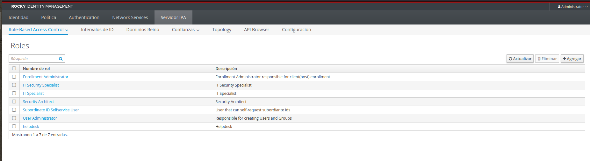
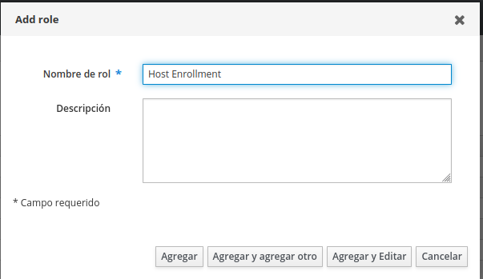
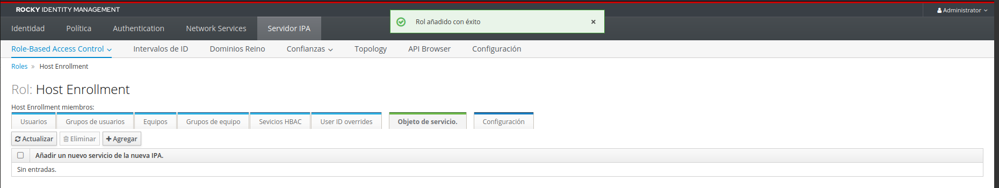
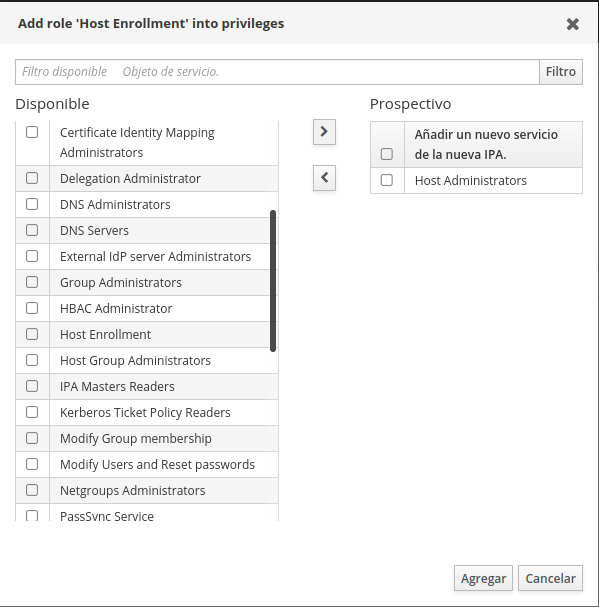
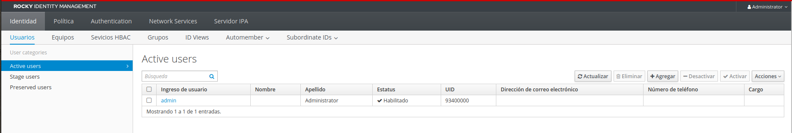
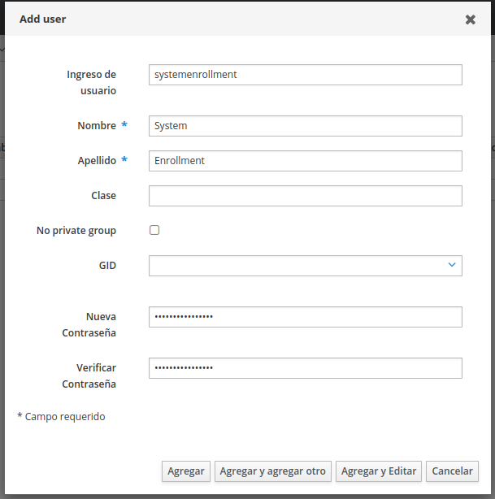
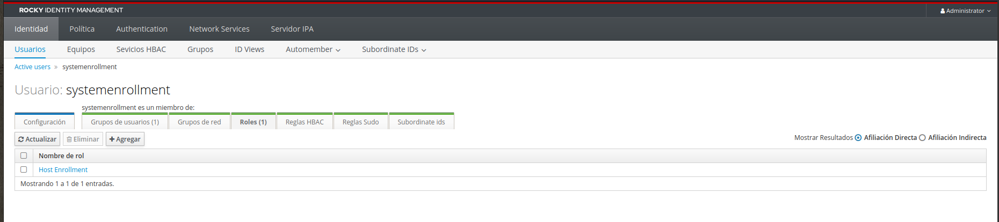
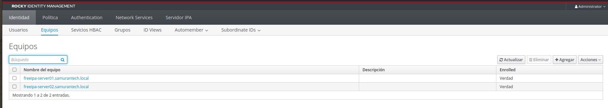

En este post empezaremos a añadir servidores a nuestro dominio local, el cual desplegamos en el anterior [post](https://www.samurantech.com/instalar-freeipa-server-rockylinux/), para poder conectarnos a ellos mediante la autenticación centralizada que nos ofrece IPA.

Para este caso voy a usar de cliente otro Rocky Linux, pero dejaré también los comandos para instalarlo en un Ubuntu.

Antes de empezar a hacer nada en el cliente, vamos a crear un usuario en FreeIPA que sólo se utilice para unir hosts al dominio, ya que nos ayudará a nivel de seguridad y a la hora de la automatización.

## Creación rol para añadir equipos al dominio

Los siguiente pasos se hacen desde la UI del servidor de FreeIPA.

Empezamos creando el rol mencionado con los permisos necesarios para poder unir los equipos al dominio y para eso iremos al apartado de `Servidor IPA` y en la pestaña que sale por defecto, `Role-Based Access Control` (o sus siglas `RBAC`), y agregamos uno al que llamaremos `Host Enrollment`.



Al crearlo, daremos a `Agregar y Editar` para que nos lleve a la ventana donde podemos configurar los permisos.



Vamos a la pestaña `Objeto de servicio` y `Agregar`.



El permiso que vamos a utilizar es `Host Administrators`.



## Creación usuario para añadir equipos al dominio

Ahora vamos a la parte de crear el usuario, por lo que iremos a la parte de `Identidad > Usuarios` para poder hacerlo, en mi caso llamaré al usuario `systemenrollment`, y rellenamos los datos que nos solicitan. También daremos a `Agregar y Editar` para añadir ya el rol al usuario, aunque se puede hacer después sin ningún problema pinchando sobre el nombre del usuario.

Un consejo que os doy aquí es que pongáis una contraseña cualquiera, accedáis con el usuario, ya que os pedirá cambiar la contraseña y ya ahí le ponéis la contraseña final que queráis.





Dentro del apartado del usuario que acabamos de crear, pinchamos sobre la pestaña `Roles` y agregamos que tenga el rol `Host Enrollment`.



## Añadir equipos al dominio

Una vez tengamos nuestro usuario creado, lo siguiente es instalar el paquete necesario y ejecutar el comando para unirlo al dominio.

Para instalarlo en Rocky Linux el comando sería:

```bash
sudo dnf install freeipa-client -y
```

Y para Ubuntu:

```bash
sudo apt install freeipa-client -y
```

>La opción `-y` es para que se instale automáticamente.

Teniendo ya lo necesario instalado, tenemos que hacer unas configuraciones en el cliente antes de unir el equipo al dominio.

El primero es añadir en `/etc/hosts` el dominio, quedando de la siguiente manera:

```text
127.0.1.1 freeipa-server02.samurantech.local freeipa-server02
```

Y la otra configuración a realizar, es cambiar para que el servidor DNS sea el servidor de FreeIPA.

Con esto ya podemos ejecutar el comando que agregue el servidor al dominio, siendo el mismo para los distintos sistemas operativos Linux.

```bash
sudo ipa-client-install --mkhomedir --enable-dns-update --principal=systemenrollment --password=<PASSWORD> -U
```

>`<PASSWORD>` es la contraseña que habéis puesto para dicho usuario.

Ahora os explicaré que significa cada parámetro:

- `--mkhomedir` Crea la carpeta `/home/` para los usuarios que inician sesión por primera vez.
- `--enable-dns-update` Permite que haga actualizaciones en el DNS cuando se detecta que la IP de la máquina cambie.
- `--principal` El usuario con el que vamos a unir el equipo.
- `--password` La contraseña del usuario.
- `-U` Para que la instalación sea desatendida, que no requiera interactuación con el usuario.

Una vez hecho todo esto, ya nos aparecerá en nuestro IPA para que podamos acceder con los usuarios que vayamos creando en él.

Esto lo podéis ver en el apartado de `Equipos`, como muestro a continuación. El nombre del equipo que he usado para este post es `freeipa-server02.samurantech.local`.


Espero que os haya gustado y os haya servido de ayuda. ¡Hasta la próxima!
