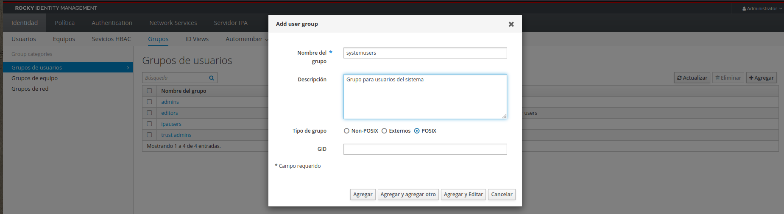
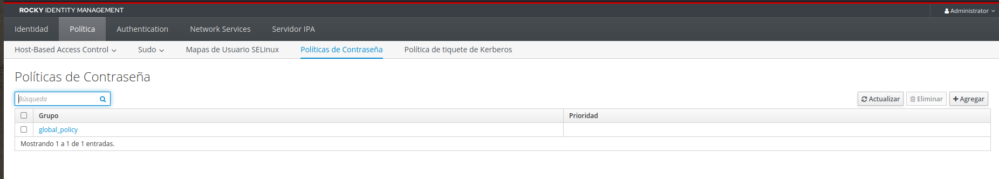
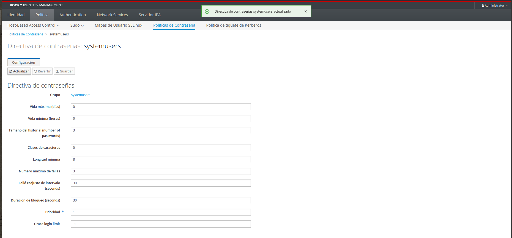

A la hora de crear usuarios que usaremos para servicios en nuestro FreeIPA, nos interesa que la contraseña de estos no cambien. Así que lo que haremos en este post es crear una política que evite que caduquen.

## Crear grupo

Antes de crear la política, vamos a crear un grupo donde irán los usuarios que queramos que no se les cambie la contraseña cada cierto tiempo y al que asociaremos la política que crearemos más adelante.

En el apartado de `Identidad > Grupos` de nuestro servidor crearemos un grupo, en mi caso lo llamaré `systemusers`. El resto de parámetros los dejaremos como están, aunque podéis poner la descripción que queráis.

## Crear política contraseña

Para ello nos iremos al apartado `Política > Políticas de Contraseña`.

Ahí añadiremos una nueva, con el botón a la derecha que pone `Agregar`, donde pondremos el grupo al que queremos asociar y una prioridad, en mi caso pondré 1, porque quiero que se aplique sobre las demás. Guardamos dando a `Agregar y Editar` para continuar con la configuración.

En el siguiente pantallazo nos pedirán que pongamos la longitud mínima de contraseña, nº de intentos fallidos y más opciones, pero la que nos interesa es la opción de `Vida máxima` que es la que estipulará que no caduque nuestra contraseña. Le pondremos el valor a **0** (cero) para que no expire, el resto de valores, podéis ponerlo como queráis realmente, al gusto del consumidor.

Ya sólo será meter usuarios del sistema, o usuarios que no queramos que su contraseña caduque, al grupo que hemos creado anteriormente y tiene asociado la política que acabamos de crear.

Espero que os haya gustado y os haya servido de ayuda. ¡Hasta la próxima!
