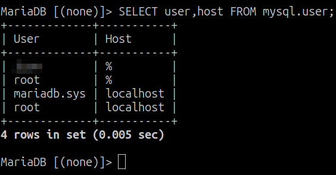
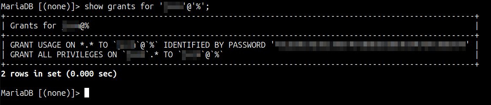

Este post será algo breve aunque muy útil si os pasa como a mí que está más acostumbrado a trabajar con PostgreSQL y tenéis que cambiar a MySQL, parecéis un elefante en una cacharrería.

Para poder ver los usuarios creados en un servidor MySQL, tendremos que ejecutar el siguiente comando desde la propia consola de MySQL para que muestre el usuario y los hosts desde los que tiene permitido acceder. Con este comando no tendremos que elegir la BDD de mysql previamente porque ya se lo estamos indicando en el `FROM`.

```sql
MariaDB [(none)]> SELECT user,host FROM mysql.user;
```



El host `%` significa que puede acceder desde que cualquier sitio.

# Permisos

Para poder ver los permisos asociados tendremos que ejecutar el siguiente comando desde la propia consola de MySQL.

```sql
MariaDB [(none)]> show grants for 'usuario'@'%';
```

El formato del usuario tiene que ser `'usuario'@'host'`, ya que en MySQL se puede distinguir los permisos según el host además de por BDD. El output del comando sería el siguiente.



La primera línea, la de `GRANT USAGE...` es para indicar que el usuario existe para el host indicado y con la contraseña hasheada. La segunda línea, la de `GRANT ALL...` indica sobre qué BDD tiene permisos y qué permisos tiene, en este ejemplo tiene todos los que se puede tener (SELECT, UPDATE, DELETE, INSERT, CREATE, DROP...).

Con esto ya sabremos qué usuarios tenemos en nuestro MySQL, además sobre qué puede tocar y qué no.

Espero que os haya gustado y os haya servido de ayuda. ¡Hasta la próxima!
