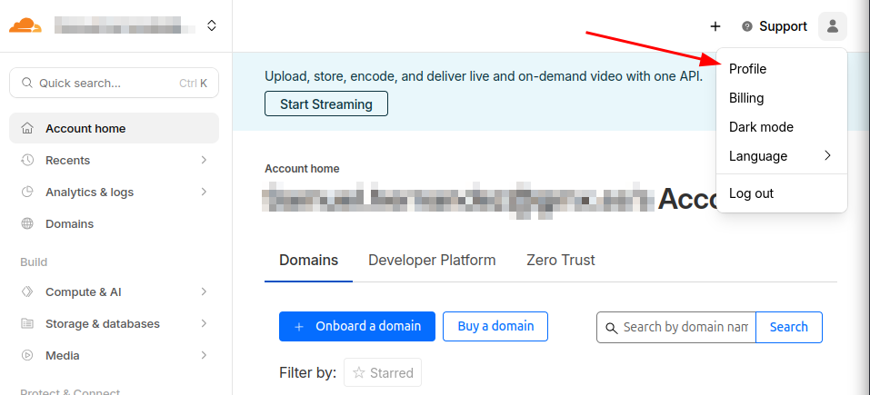
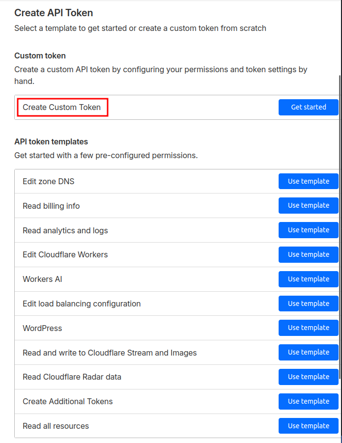
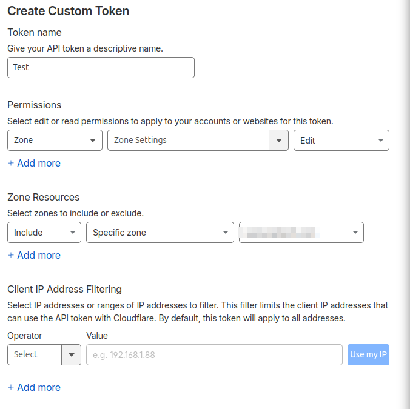

Si trabajáis con Cloudflare, este post os servirá de mucho, ya que vamos a empezar creando un token que nos permita automatizar despliegues y configuraciones que nos ahorrarán muchísimo trabajo.

Para empezar, tendremos que ir a nuestra cuenta y en la parte superior derecha, donde sale el monigote, le damos a `Profile` o `Perfil` según el idioma en el que lo tengas.

En la sección de `Profile` vamos a `API Tokens` y le damos a `Create Token`. Cloudflare te recomienda usar **Account API Tokens** en caso de no tener una cuenta de servicio para estas cosas, pero al caso el proceso es el mismo.

En la siguiente pantalla nos saldrán varias plantillas con permisos para ciertos escenarios, pero yo usaré en este caso el `Create Custom Token`.

Aquí tendremos que poner el nombre del API Token, los permisos que queremos que tenga (si es sobre la cuenta o una zona DNS), si queremos que tenga permisos sobre todas las zonas o sobre una en concreto y un filtrado por IP para que sólo se pueda utilizar desde donde nosotros indiquemos.

En este caso, le hemos dado permisos para que pueda editar la configuración de la zona DNS y que sólo sea para un dominio en específico.

Para continuar nos saldrá un resumen de lo que hemos hecho y podremos finalizar el proceso una vez le hayamos dado a `Create Token`.

Con esto ya sabremos cómo crear un API Token en Cloudflare, el cual usaremos en futuros posts.

Espero que os haya gustado y os haya servido de ayuda. ¡Hasta la próxima!
