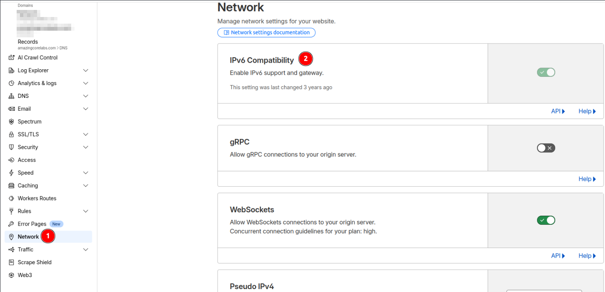
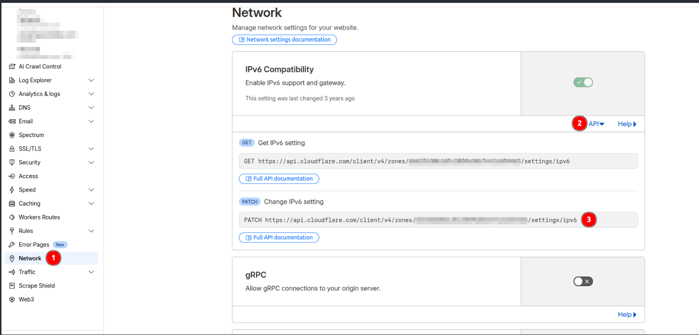
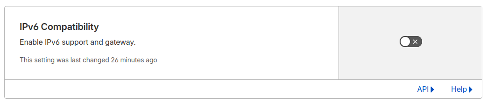

Aunque IPv6 sea el futuro, conozco a más de uno que se ha tenido que pelear con él y ha tenido más problemas que otra cosa. Por eso en este post, vamos a ver cómo desactivar IPv6 para Cloudflare, ya que no es dar a un click y listo.

***Disclaimer: A día 13 de noviembre de 2025, día en el que me tocó hacer esto, este método era válido.***

Para poder desactivar la compatibilidad con IPv6 hay que hacerlo vía API, ya que por interfaz web está desactivada. Se encuentra en la parte de Network/Red:



Para poder hacerlo, previamente hay que crear un API token que tenga permisos de editar el parámetro `Zone.Zone Settings`. Para ver cómo crear uno, en el [post anterior](https://www.samurantech.com/posts/crear-apitoken-cloudflare/) está indicado cómo hacerlo.

Una vez creado, tendremos que ejecutar el siguiente curl:

```bash
curl -XPATCH https://api.cloudflare.com/client/v4/zones/<id_zone>/settings/ipv6 -H 'Content-Type: application/json' --header "Authorization: Bearer ..." -d '{"value":"off"}'
```

La `<id_zone>` se puede obtener del apartado API del pantallazo anterior:



Con el curl ejecutado, ya aparecerá desactivado.



Para poder volver a activarlo, sería cambiar el valor de `off` a `on`.

```bash
curl -XPATCH https://api.cloudflare.com/client/v4/zones/<id_zone>/settings/ipv6 -H 'Content-Type: application/json' --header "Authorization: Bearer ..." -d '{"value":"on"}'
```

Con esto ya sabremos cómo desactivar IPv6 en Cloudflare, ahorrándonos varios dolores de cabeza.

Espero que os haya gustado y os haya servido de ayuda. ¡Hasta la próxima!
