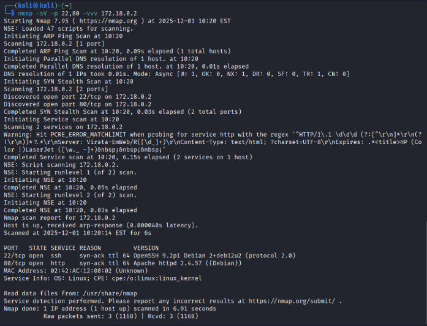
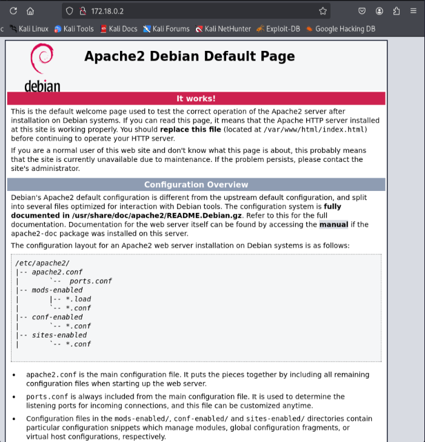
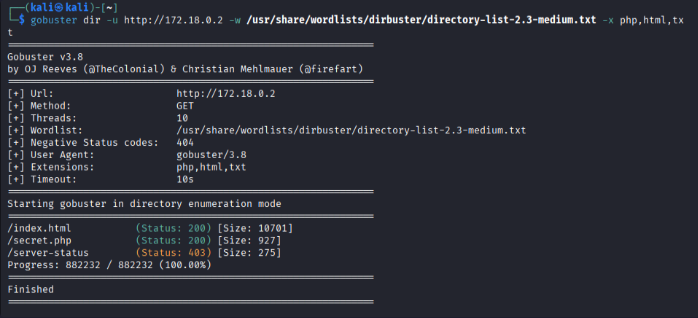
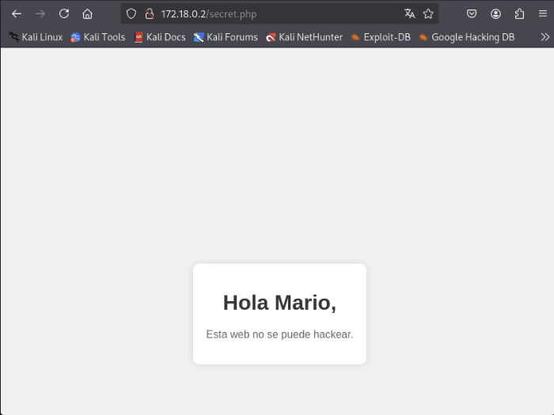
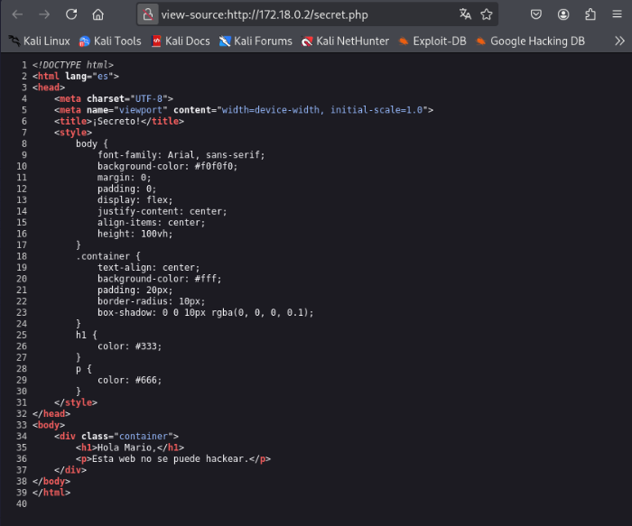
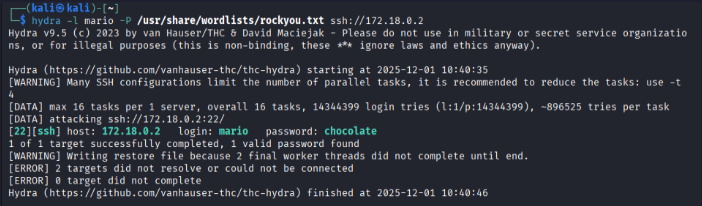
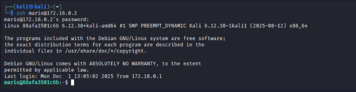
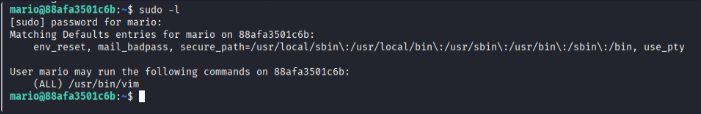
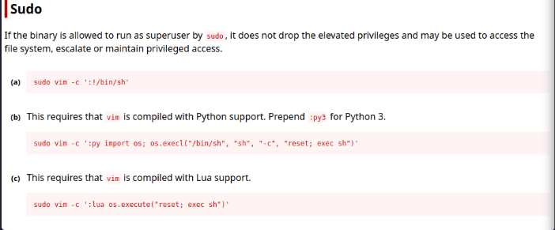
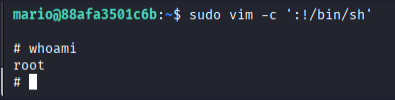

Aparte de hacer las cosas propias de un administrador de sistemas, de vez en cuando me da por curiosear cosas de ciberseguridad, aunque realmente no sea mi fuerte. Como llevo ya un tiempo que me ha dado por documentar las cosas que voy haciendo, aprovecho y hago un post al respecto.

Una buena forma de empezar en el mundillo con labs que son muy interesantes son los que te proporcionan en [Dockerlabs](https://dockerlabs.es/), que tienen varios labs con distintos niveles, por lo que os recomiendo mucho que le echéis un vistazo a su web, os hagáis una cuenta y hagáis los labs que más os llamen la atención.

En este primer post, empezaremos por un lab de dificultad muy fácil, `Trust`. Comentar que en estos posts, sólo pondré los pasos que he hecho yo para llegar a la solución, pasos como el despliegue del contenedor me lo saltaré, ya que en la propia web viene indicado de forma bastante clara.

Con todo esto dicho, vamos al lío.

La IP del contenedor es la 172.18.0.2, la cual te sale según se despliega el lab.

## Escaneo de puertos

Realizamos un escaneo para ver que puertos están abiertos:
```bash
nmap -sS 172.18.0.2
```

Resultado:  


Obtenemos que hay dos puertos abiertos, el 22 (SSH) y 80 (HTTP). Hacemos un escaneo de esos puertos para obtener más información al respecto.
```bash
nmap -sV -p 22,80 -vvv 172.18.0.2
```

Resultado:  


Nos conectamos por firefox a la URL y nos sale la página por defecto de Apache2:


Para poder continuar vamos a hacer un escaneo con el comando `gobuster` para obtener un listado de ficheros o directorios a los que se pueda acceder desde el servidor web.
```bash
gobuster dir -u http://172.18.0.2 -w /usr/share/wordlists/dirbuster/directory-list-2.3-medium.txt -x php,html,txt
```

Resultado:  


Vemos que hay disponibles, `index.html`, que es la página de inicio, `secret.php` y `/server-status`, pero este último nos da un 403.

Si nos conectamos a `secret.php` nos aparece el siguiente mensaje:


Vamos a revisar el código fuente de la web por si encontrásemos algo interesante al respecto, aunque en este caso no es así.  


Vamos a probar ahora con **SSH** y con el usuario **mario** que nos ha salido al visitar `secret.php`. Para ello, vamos a usar la herramienta `hydra`para sacar la contraseña con un ataque de fuerza bruta (previamente hay que descomprimir el fichero `/usr/share/wordlists/rockyou.txt.gz`).

```bash
hydra -l mario -P /usr/share/wordlists/rockyou.txt ssh://172.18.0.2
```

Resultado:  


Probamos a acceder con la contraseña que nos ha salido:


Vamos a comprobar si el usuario puede ejecutar algún binario como sudo con el siguiente comando.
```bash
sudo -l
```

Y vemos que puede ejecutar `vim`


Miramos en la URL https://gtfobins.github.io/ cómo podemos explotar ese acceso sudo a vim. La URL final donde podemos encontrar esto es https://gtfobins.github.io/gtfobins/vim/#sudo


Ejecutamos el primer comando y comprobamos que usuario somos después de eso:


Con esto hemos conseguido escalar privilegios y por lo tanto, terminar el lab.

Espero que os haya gustado y os haya servido de ayuda. ¡Hasta la próxima!
