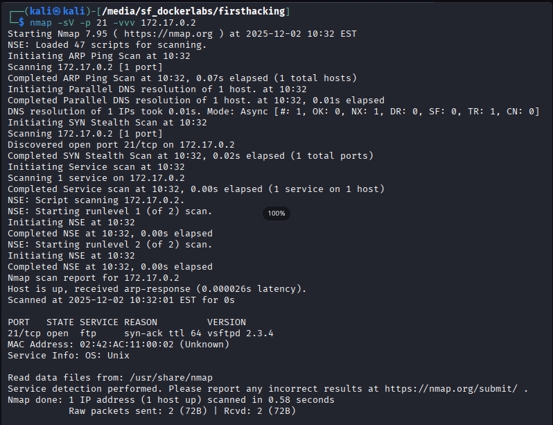
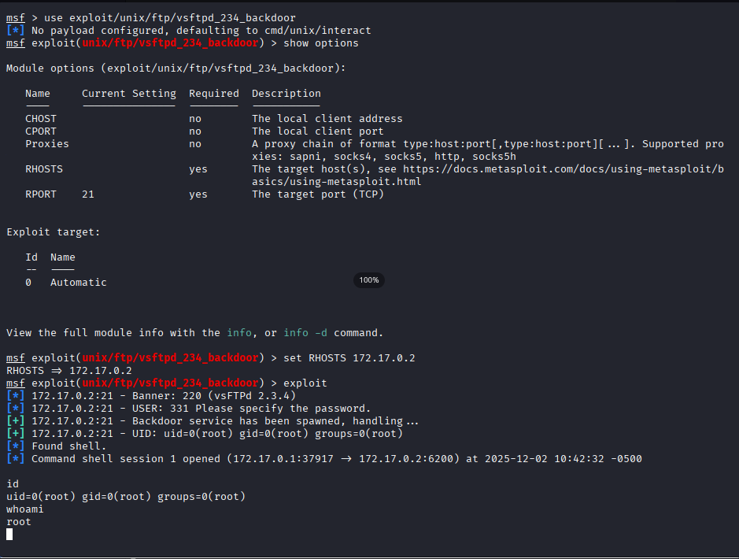

Siguiendo con la serie de posts sobre ciberseguridad, vamos a por otro lab muy sencillo pero que nos ayudará con el tema de saber buscar vulnerabilidad por Google y explotarlas con MetaSploit.

La IP del contenedor es la 172.17.0.2, la cual te sale según se despliega el lab.

## Escaneo de puertos

Realizamos el escaneo de puertos:
```bash
nmap -sS 172.17.0.2
```

Resultado:  
{: .w-75 .normal}

Obtenemos que hay un puerto abierto, el 21 (FTP). Hacemos un escaneo del puerto para obtener más información al respecto.
```bash
nmap -sV -p 21 -vvv 172.17.0.2
```

Resultado:  


Si hacemos una búsqueda rápida en google sobre "exploit vsftpd 2.3.4", nos sale que está relacionada con el [CVE-2011-2523](https://www.incibe.es/en/incibe-cert/early-warning/vulnerabilities/cve-2011-2523).
En rapid7 cuentan con un módulo para poder explotar dicha vulnerabilidad, <https://www.rapid7.com/db/modules/exploit/unix/ftp/vsftpd_234_backdoor/>

Abrimos `msfconsole`, cargamos el módulo, seteamos el host destino y ejecutamos.



Con esto ya tenemos acceso root al servidor.

Espero que os haya gustado y os haya servido de ayuda. ¡Hasta la próxima!
