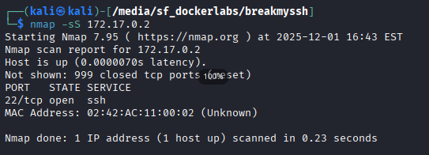
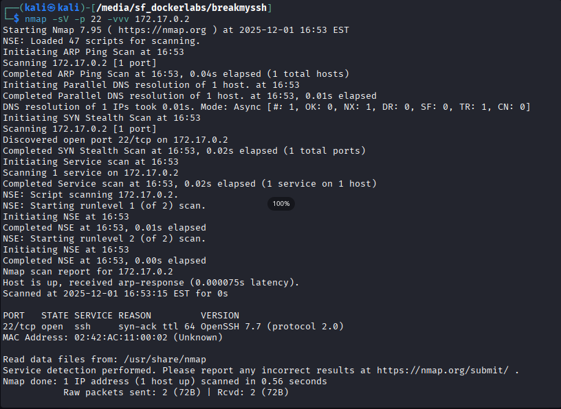
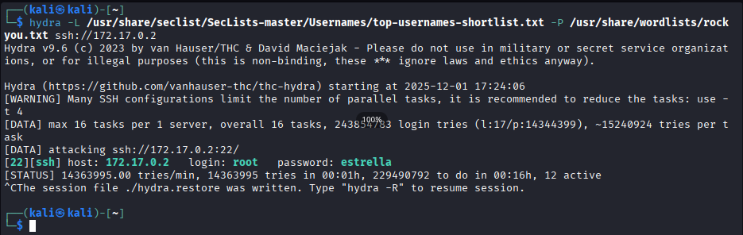
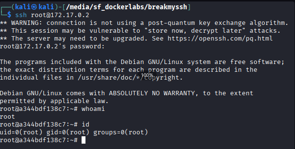

Seguimos con otro lab, donde en esta ocasión tendremos que vulnerar el servicio SSH del servidor víctima para poder completarlo. Como siempre, empezamos viendo cual es la IP y haciendo un escaneo de puertos.

La IP del contenedor es la 172.17.0.2.

## Escaneo de puertos

Realizamos el escaneo de puertos:
```bash
nmap -sS 172.17.0.2
```

Resultado:  
{: .w-75 .normal}

Obtenemos que tenemos acceso por el puerto 22 (SSH). Hacemos un escaneo más extenso sobre dicho puerto para obtener más información al respecto.
```bash
nmap -sV -p 22 -vvv 172.17.0.2
```

Resultado:  
{: .w-75 .normal}

Nos devuelve la versión **OpenSSH 7.7**, la cual tiene una vulnerabilidad [CVE-2018-15473](https://www.incibe.es/incibe-cert/alerta-temprana/vulnerabilidades/cve-2018-15473), la cual nos permite hacer una enumeración de usuarios con los que poder conectarnos.

Vamos a probar a hacer un ataque de fuerza bruta usando el listado de top usernames que da SecList.

```bash
hydra -l /usr/share/seclist/SecLists-master/Usernames/top-usernames-shortlist.txt -P /usr/share/wordlists/rockyou.txt ssh://172.17.0.2
```

Resultado:  
{: .w-75 .normal}

Ahí sale que la contraseña del usuario `root` es `estrella`. En este punto tuve que parar el proceso antes de que terminase porque parecía que mi ordenador iba a despegar de un momento a otro.

Probamos a conectarnos directamente con el usuario root, ponemos la contraseña que hemos obtenido antes y vemos que ya tenemos acceso al servidor.

{: .w-75 .normal}

Con esto ya habremos terminado el lab.

Espero que os haya gustado y os haya servido de ayuda. ¡Hasta la próxima!
