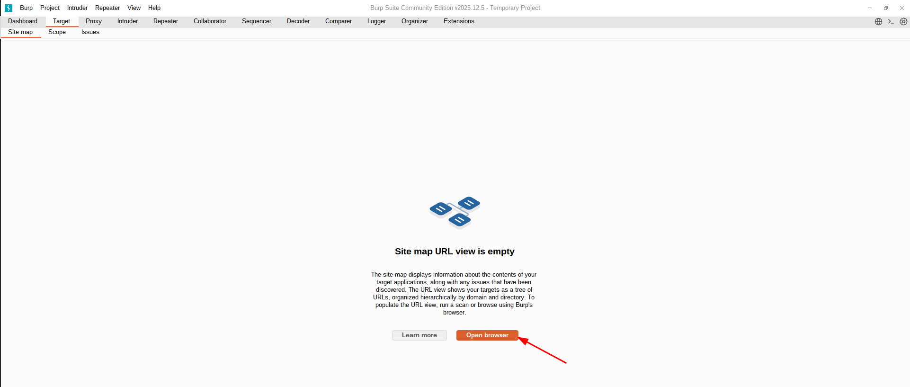

Al instalar o actualizar Burp Suite Community en Linux, hay veces que no podremos abrir el navegador que tiene integrado, aunque demos al botón, no ocurre nada.



Esto es debido a que los permisos y el propietario del ejecutable que utiliza no están bien configurados. Para ello tendremos que ir a la carpeta donde lo tenemos instalado, que si no sabemos cuál es, con Burp Suite abierto, ejecutamos el siguiente comando:

```bash
$ ps aux | grep burp
samuel     56063  6.7  5.2 16401328 842860 ?     Sl   12:22   0:54 /opt/BurpSuiteCommunity/jre/bin/java -splash:/opt/BurpSuiteCommunity/.install4j/s_fukc9n.png --add-opens java.base/java.lang=ALL-UNNAMED --add-opens java.base/javax.crypto=ALL-UNNAMED --add-opens java.desktop/javax.swing=ALL-UNNAMED --add-opens java.desktop/java.awt=ALL-UNNAMED --add-opens java.desktop/java.awt.color=ALL-UNNAMED --add-opens jdk.crypto.cryptoki/sun.security.pkcs11=ALL-UNNAMED -XX:MaxRAMPercentage=50 -classpath /opt/BurpSuiteCommunity/.install4j/i4jruntime.jar:/opt/BurpSuiteCommunity/.install4j/launcher5925f5b4.jar:/opt/BurpSuiteCommunity/burpsuite_community.jar install4j.burp.StartBurp
samuel     64226  0.0  0.0   9184  2460 pts/1    S+   12:35   0:00 grep --color=auto burp
```

En mi caso lo instalé en `/opt/BurpSuiteCommunity`.

Nos metemos en dicha carpeta y dentro de ella tenemos que ir a `burpbrowser/<version>`, donde `<version>` en mi caso es la `144.0.7559.96`. El comando completo sería este:

```bash
cd /opt/BurpSuiteCommunity/burpbrowser/144.0.7559.96
```

En la carpeta estará el ejecutable `chrome-sandbox` al que tenemos que cambiar el propietario y los permisos para que funcione. Es importante seguir este orden, primero propietario y luego permisos, porque si no, no va a funcionar.

```bash
sudo chown root: chrome-sandbox
sudo chmod 4755 chrome-sandbox
```

Con esto ya funcionará el botón de abrir navegador. Aunque lo he comentado al principio, al actualizar la aplicación, tendremos que hacer estos pasos de nuevo, ya que por algún motivo, no lo corrigen en el instalador.

Espero que os haya gustado y os haya servido de ayuda. ¡Hasta la próxima!
